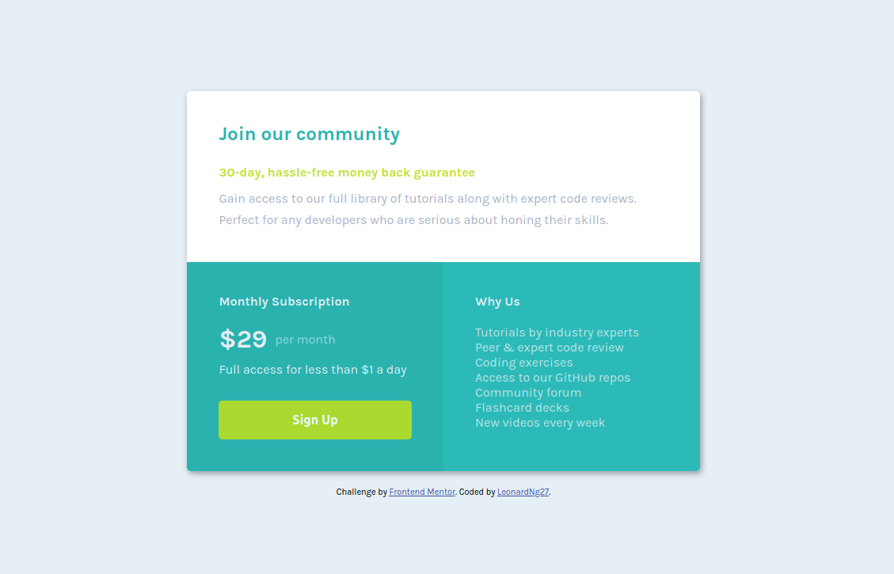

# Frontend Mentor - Single price grid component solution

This is a solution to the [Single price grid component challenge on Frontend Mentor](https://www.frontendmentor.io/challenges/single-price-grid-component-5ce41129d0ff452fec5abbbc). Frontend Mentor challenges help you improve your coding skills by building realistic projects. 

## Table of contents

- [Overview](#overview)
  - [The challenge](#the-challenge)
  - [Screenshot](#screenshot)
  - [Links](#links)
- [My process](#my-process)
  - [Built with](#built-with)
  - [What I learned](#what-i-learned)
  - [Useful resources](#useful-resources)
- [Author](#author)
- [Acknowledgments](#acknowledgments)

## Overview

### The challenge

Users should be able to:

- View the optimal layout for the component depending on their device's screen size
- See a hover state on desktop for the Sign Up call-to-action

### Screenshot



### Links

- Solution URL: [Repo URL](https://github.com/dungnq271/pricing-card-frontend-mentor-challenge/tree/gh-pages)
- Live Site URL: [Live URL](https://dungnq271.github.io/pricing-card-frontend-mentor-challenge/)

## My process

### Built with

- Semantic HTML5 markup
- CSS custom properties
- Flexbox
- Mobile-first workflow

### What I learned

This is my first project in which I learned to structure the HTML and later create the CSS layout based on the image design.

Here are some code snippets I am proud of:

```html
<p><span>Gain access to our full library of tutorials along with expert code reviews.</span> <span>Perfect for any developers who are serious about honing their skills.</span></p>	
```
> This is to change the layout of the normal texts in the top section from mobile view to desktop view

```CSS
span {
    display: inline;
}
```
> accompanied by this css style in mobile view

```CSS
span {
	display: block;
}
```
> and this style in desktop view
```css
body {
    display: flex;
    flex-direction: column;
    justify-content: center;
    align-items: center;
}
```
> Center the price grid in the webpage both horizontally and vertically. My first CSS Flexbox code.

### Useful resources

- [MDN Web Docs](https://developer.mozilla.org/en-US/) - Indispensable resource for web developers. I learned CSS Flexbox model mainly through this site and frequently refer to a lot of other language-specific methods and attributes.
- [Zach](https://github.com/zachgoll)'s [Fullstack Roadmap Series Repository](https://github.com/zachgoll/fullstack-roadmap-series/blob/main/free-code-camp.md) - The repository contains the resources for the course that I followed.

## Author

- Frontend Mentor - [@@dungnq271](https://www.frontendmentor.io/profile/dungnq271)
- Twitter - [@LeonardNg27](https://www.frontendmentor.io/profile/dungnq271)

## Acknowledgments

Inspired from [@zg_dev](https://x.com/zg_dev)'s [Frontend Web Development Bootcamp Course](https://www.youtube.com/watch?v=zJSY8tbf_ys)
